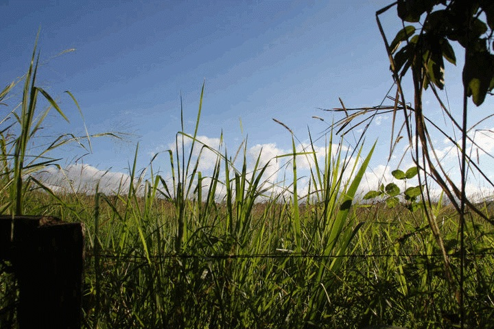
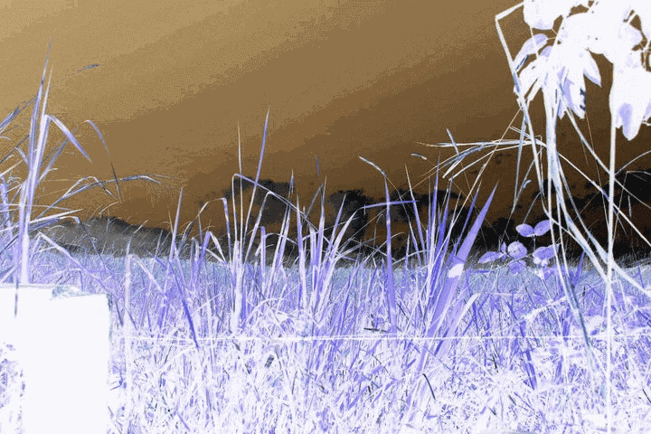
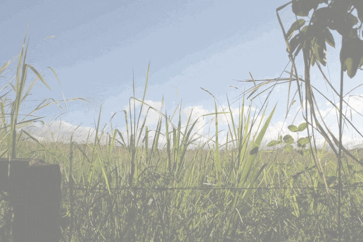
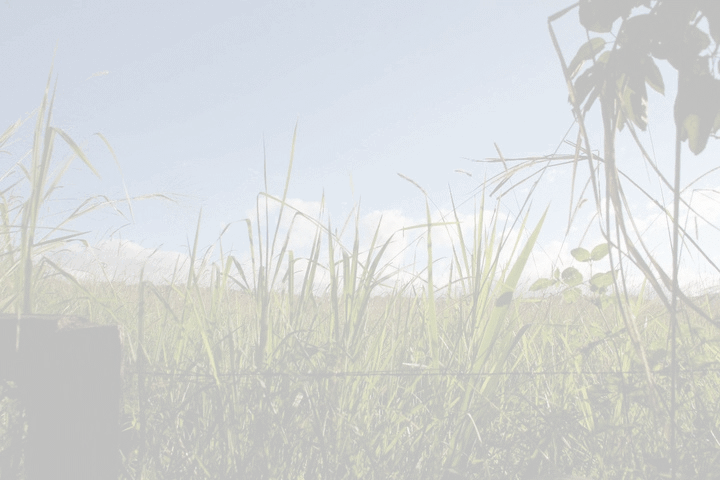
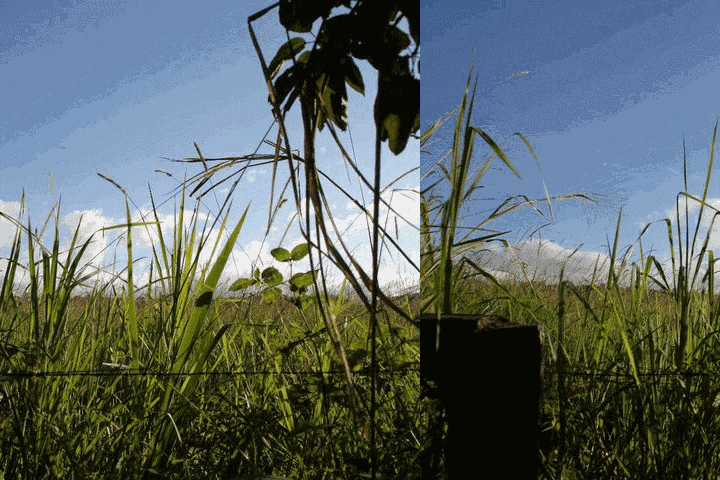

Participation Exercise
======================

### Due TBA

This assignment will be a graded in-class exercise. The assignment will be worth 10 points and will count toward the "Participation and Quizzes" portion of your final grade.

<!--
You are required to submit your work by 5:00pm on October 4, 2016. 
-->

##Requirements
For this assignment, you will implement several methods that manipulate jpg images. 

You should make sure to get lots of help with this exercise as Project 2 will be very similar!

Download the following java files: 

- [ImageManipulator.java](https://raw.githubusercontent.com/CS112-S17/labs/master/image_exercise/ImageManipulator.java)
- [ImageTester.java](https://raw.githubusercontent.com/CS112-S17/labs/master/image_exercise/ImageTester.java)
- [Picture.java](https://raw.githubusercontent.com/CS112-S17/labs/master/image_exercise/Picture.java)
- [Pixel.java](https://raw.githubusercontent.com/CS112-S17/labs/master/image_exercise/Pixel.java)

This assignment is a modified version of one given by Richard Wicentowski and Tia Newhall (2005) at Swarthmore College. Credit (and thanks!) go to them for the inspiration and starter code.

Complete all methods as described in the documentation of [ImageManipulator.java](https://raw.githubusercontent.com/CS112-S17/labs/master/image_exercise/ImageManipulator.java). 

You **should not** modify any of the code in the other three classes.

For full credit, your submission must pass all of the tests in the class [ImageTester.java](https://raw.githubusercontent.com/CS112-S17/labs/master/image_exercise/ImageTester.java). Make sure to download the original image and store in a file called "original.jpg" in the directory where you will run your program. The resulting images must look as follows:

#### Original

#### Negative

#### Lighter

#### Lightest

#### Scroll Horizontal

### Submission Requirements

1. For this assignment, you will submit the following files: `ImageManipulator.java`. 

2. Make sure your code follows all requirements in the [Style Guidelines](https://github.com/CS112-S17/notes/blob/master/style.md).

3. Follow the instructions in the [SVN Guide](https://github.com/CS112-S17/notes/blob/master/svn_guide.md) for submitting your solution by the deadline.

4. Make sure you have submitted your work in an SVN directory: `https://www.cs.usfca.edu/svn/<username>/cs112/exercises`

### Grading Rubric

The general rubric we will use to grade your solution may be found here: [Grading Rubric](https://github.com/CS112-S17/notes/blob/master/grading_rubric.md)

### Academic Dishonesty

Any work you submit is expected to be your own original work. If you use any web resources in developing your code you are strongly advised to cite those resources. The only exception to this rule is code that is posted on the class website. The URL of the resource you used in a comment in your code is fine. If I google even a single line of uncited code and find it on the internet you may get a 0 on the assignment or an F in the class.

